# WindowsMissingRecovery PowerShell Module

[](https://github.com/cchamilt/desktop-setup/actions/workflows/ci.yml)
[](https://github.com/cchamilt/desktop-setup/actions/workflows/integration-tests.yml)

> 🔧 **Note**: Replace `cchamilt` in the badge URLs above with your actual GitHub username
[](https://www.powershellgallery.com/packages/WindowsMissingRecovery)
[](https://opensource.org/licenses/MIT)
[](docs/)

A comprehensive PowerShell module for managing Windows system recovery, backup, and restoration of critical system settings, applications, and development environments.

## 📚 Documentation

| Document | Description |
|----------|-------------|
| **[Installation Guide](docs/INSTALLATION.md)** | Step-by-step installation and setup instructions |
| **[Configuration Guide](docs/CONFIGURATION.md)** | Detailed configuration options and examples |
| **[Backup Details](docs/BACKUP_DETAILS.md)** | Comprehensive backup coverage and technical details |
| **[WSL Integration](docs/WSL_INTEGRATION.md)** | Windows Subsystem for Linux features and setup |
| **[Gaming Platforms](docs/GAMING_PLATFORMS.md)** | Gaming platform support and configuration |
| **[Cloud Storage](docs/CLOUD_STORAGE.md)** | Multi-cloud provider setup and configuration |
| **[API Reference](docs/API_REFERENCE.md)** | Complete function reference and examples |
| **[Troubleshooting](docs/TROUBLESHOOTING.md)** | Common issues and solutions |
| **[Contributing](docs/CONTRIBUTING.md)** | Development setup and contribution guidelines |
| **[Changelog](CHANGELOG.md)** | Version history and release notes |
| **[Limits & Scope](docs/LIMITS.md)** | Module limitations and scope definition |

## 🧪 Testing & Quality

| Test Suite | Status | Coverage |
|------------|--------|----------|
| **Code Quality** | [](https://github.com/cchamilt/desktop-setup/actions/workflows/ci.yml) | Static analysis, style checks |
| **Unit Tests** | [](https://github.com/cchamilt/desktop-setup/actions/workflows/ci.yml) | Core functionality, configuration |
| **Integration Tests** | [](https://github.com/cchamilt/desktop-setup/actions/workflows/integration-tests.yml) | Real Windows + WSL environment |
| **WSL Testing** | [](https://github.com/cchamilt/desktop-setup/actions/workflows/integration-tests.yml) | Real Ubuntu 22.04 in WSL 2 |
| **Package Managers** | [](https://github.com/cchamilt/desktop-setup/actions/workflows/integration-tests.yml) | Real package manager testing |

### 🔍 **Test Environment Details**
- **Real Windows Server 2022** (GitHub Actions runners)
- **Real WSL 2 + Ubuntu 22.04** (installed during tests)
- **Real Package Managers** (Chocolatey, Scoop, Winget)
- **Gaming Platform Simulation** (Steam, Epic, GOG, EA)
- **Cloud Storage Simulation** (OneDrive, Google Drive, Dropbox)
- **Comprehensive Reporting** ([View Latest Test Report](https://github.com/cchamilt/desktop-setup/actions/workflows/integration-tests.yml))

> 📊 **[View Detailed Test Results](https://github.com/cchamilt/desktop-setup/actions)** | **[Testing Documentation](.github/README.md)**

## 🚀 Quick Start

```powershell
# 1. Install the module
.\Install-Module.ps1

# 2. Initialize configuration (detects cloud storage automatically)
Initialize-WindowsMissingRecovery

# 3. Create your first backup
Backup-WindowsMissingRecovery

# 4. Set up optional components (requires admin)
Setup-WindowsMissingRecovery
```

> 💡 **New to the module?** Start with the **[Installation Guide](docs/INSTALLATION.md)** for detailed setup instructions.

```powershell
# 1. Install the module
.\Install-Module.ps1

# 2. Initialize configuration (detects cloud storage automatically)
Initialize-WindowsMissingRecovery

# 3. Create your first backup
Backup-WindowsMissingRecovery

# 4. Set up optional components (requires admin)
Setup-WindowsMissingRecovery
```

> 💡 **New to the module?** Start with the **[Installation Guide](docs/INSTALLATION.md)** for detailed setup instructions.

## Overview

The WindowsMissingRecovery module provides a robust set of tools for:

- **System Configuration Management** - Backup and restore Windows settings, registry entries, and system configurations
- **Application Management** - Backup and restore application settings and data
- **Package Manager Integration** - Support for Winget, Chocolatey, Scoop, and other package managers
- **Gaming Platform Support** - Comprehensive backup and restore for Steam, Epic Games, GOG, EA, and more
- **WSL Development Environment** - Complete WSL backup, restore, and management with package synchronization
- **Dotfile Management** - chezmoi integration for cross-machine dotfile synchronization
- **Multi-Cloud Support** - OneDrive, Google Drive, Dropbox, and custom cloud storage integration
- **Automated Scheduling** - Set up automated backup and maintenance tasks
- **Modular Setup System** - Optional component installation and configuration

```mermaid
graph TD
    A["🔍 BACKUP: Analyze-UnmanagedApplications"] --> B["Original System State"]
    B --> C["📝 unmanaged-analysis.json<br/>List of unmanaged apps"]
    
    D["💾 BACKUP PROCESS"] --> E["Package Manager Data<br/>(Store, Scoop, Choco, Winget)"]
    D --> F["Game Manager Data<br/>(Steam, Epic, GOG, EA)"]
    D --> G["WSL Environment<br/>(Packages, Config, Dotfiles)"]
    D --> H["Cloud Storage<br/>(OneDrive, Google Drive, Dropbox)"]
    D --> C
    
    I["🔄 RESTORE PROCESS"] --> J["Install Package Managers"]
    I --> K["Install Game Managers"]
    I --> L["Restore WSL Environment"]
    I --> M["Setup chezmoi Dotfiles"]
    I --> N["Install Applications"]
    
    O["🔍 POST-RESTORE: Compare-PostRestoreApplications"] --> P["Load Original Analysis"]
    O --> Q["Scan Current System"]
    O --> R["Compare Original vs Current"]
    
    P --> C
    Q --> S["Current System State<br/>(after restore)"]
    
    R --> T["✅ Successfully Restored<br/>(were unmanaged, now installed)"]
    R --> U["❌ Still Unmanaged<br/>(need manual install)"]
    
    T --> V["📊 restored-apps.json"]
    U --> W["📋 still-unmanaged-apps.json"]
    U --> X["📈 still-unmanaged-apps.csv"]
    
    R --> Y["📈 Post-Restore Analysis<br/>Success Rate: X%"]
    
    style A fill:#e3f2fd
    style O fill:#e8f5e8
    style T fill:#c8e6c9
    style U fill:#ffcdd2
    style Y fill:#fff3e0
    style G fill:#f3e5f5
    style H fill:#e0f2f1
```



## Installation Workflow

The module follows a clean separation of concerns with three distinct phases:

### 1. Install (Copy Files Only)
```powershell
.\Install-Module.ps1
```
- Copies module files to PowerShell modules directory
- No configuration or setup performed
- Use `-Force` to overwrite existing files
- Use `-CleanInstall` for fresh installation

### 2. Initialize (Configuration Only)
```powershell
Initialize-WindowsMissingRecovery
```
- Sets up module configuration
- Configures backup locations and cloud providers
- Creates configuration files
- Detects and configures cloud storage paths automatically
- No actual setup or installation of components

### 3. Setup (Optional Components)
```powershell
Setup-WindowsMissingRecovery
```
- **Requires Administrator privileges**
- Installs and configures optional components
- Prompts for each available setup script
- Installs scheduled tasks for automation

## Core Public Functions

### Module Management
- `Initialize-WindowsMissingRecovery` - Configure module settings and backup locations
- `Setup-WindowsMissingRecovery` - Install and configure optional system components
- `Get-WindowsMissingRecovery` - Get current module configuration
- `Set-WindowsMissingRecovery` - Update module configuration

### Backup and Restore Operations
- `Backup-WindowsMissingRecovery` - Create comprehensive system backup
- `Restore-WindowsMissingRecovery` - Restore system from backup
- `Update-WindowsMissingRecovery` - Update system packages and configurations

### Task Management
- `Install-WindowsMissingRecoveryTasks` - Install scheduled tasks for automated operations
- `Remove-WindowsMissingRecoveryTasks` - Remove scheduled tasks

### Script Configuration
- `Set-WindowsMissingRecoveryScripts` - Configure which backup/restore/setup scripts are enabled
- `Sync-WindowsMissingRecoveryScripts` - Synchronize script configurations

### Utilities
- `Convert-ToWinget` - Convert package installations to Winget format
- `Test-WindowsMissingRecovery` - Test module functionality and configuration

## Available Setup Components

When running `Setup-WindowsMissingRecovery`, you can choose from these optional components:

### Development Environment
- **WSL (Windows Subsystem for Linux)** - Complete WSL setup with Ubuntu, package management, and configuration
- **chezmoi Dotfiles** - Configure chezmoi for cross-machine dotfile management with git repository support
- **WSL Fonts** - Install development fonts for WSL (Nerd Fonts, Ubuntu fonts, programming fonts)
- **Package Managers** - Install and configure Chocolatey, Scoop, and other package managers

### Gaming Platforms
- **Steam Games** - Configure Steam game settings, library management, and game installations
- **Epic Games** - Configure Epic Games Launcher and Legendary CLI for game management
- **GOG Games** - Configure GOG Galaxy settings and game library management
- **EA Games** - Configure EA App/Origin settings and game installations

### Productivity and Security
- **KeePassXC** - Install and configure password manager with database setup
- **Custom Profiles** - Configure PowerShell profiles and terminal customizations
- **Windows Defender** - Configure Windows Defender settings and security policies
- **System Restore Points** - Configure automatic restore point creation and management

### System Optimization
- **Remove Bloat** - Remove unwanted pre-installed software and manufacturer bloatware
- **Windows Features** - Configure optional Windows features and capabilities

## Cloud Provider Support

The module automatically detects and supports multiple cloud storage providers:

### Fully Supported (Automatic Detection)
- **OneDrive Personal** - Automatic path detection and configuration
- **OneDrive for Business** - Automatic path detection and configuration

### Supported (Manual Configuration)
- **Google Drive** - Manual path configuration required
- **Dropbox** - Manual path configuration required
- **Custom Cloud Storage** - Any cloud storage with local sync folder

### Cloud Integration Features
- Automatic backup path detection
- Multi-cloud backup support
- Cloud storage health checking
- Configurable backup retention policies
- Cross-machine synchronization

## WSL Integration

Comprehensive Windows Subsystem for Linux support:

### WSL Backup Features
- **Package Management**: APT, NPM, PIP, Snap, Flatpak package lists
- **Configuration Files**: wsl.conf, fstab, hosts, environment variables
- **Shell Configurations**: .bashrc, .profile, .zshrc, custom shell settings
- **Development Tools**: Git configuration, SSH keys, development tool configs
- **Home Directory**: Selective backup of important dotfiles and configurations
- **Distribution Info**: WSL version, distribution details, kernel information

### WSL Restore Features
- Automated package installation across all package managers
- Configuration file restoration with proper permissions
- Shell environment restoration
- Development tool reconfiguration
- Home directory restoration
- Git repository checking and validation

### chezmoi Integration
- **Dotfile Management**: Complete chezmoi setup and configuration
- **Git Repository Support**: Automatic repository cloning and setup
- **Template Support**: chezmoi templates and encrypted secrets
- **Cross-Machine Sync**: Consistent dotfiles across multiple machines
- **Backup and Restore**: chezmoi source directory and configuration backup

## Configuration System

The module uses a flexible configuration system with:

### Configuration Files
- `Config/windows.env` - Main module configuration
- `Config/scripts-config.json` - Script enablement configuration
- `Templates/` - Template files for initial setup

### Key Configuration Areas
- **Backup Settings** - Retention, paths, exclusions, cloud integration
- **Cloud Integration** - Multi-provider support with automatic detection
- **Email Notifications** - Success/failure notifications with detailed reporting
- **Logging** - Configurable logging levels and paths
- **Script Management** - Enable/disable individual backup/restore/setup scripts
- **WSL Configuration** - WSL-specific backup and restore settings
- **Gaming Platforms** - Game library and settings management

## Usage Examples

### Complete Setup Workflow
```powershell
# 1. Install the module files
.\Install-Module.ps1

# 2. Configure the module (detects cloud storage automatically)
Initialize-WindowsMissingRecovery

# 3. Set up optional components (as Administrator)
Setup-WindowsMissingRecovery
```

### Backup and Restore Operations
```powershell
# Create a comprehensive backup (includes WSL and dotfiles)
Backup-WindowsMissingRecovery

# Restore from a specific backup
Restore-WindowsMissingRecovery -BackupDate "2024-03-20"

# Update system packages (includes WSL packages)
Update-WindowsMissingRecovery
```

### WSL and Development Environment
```powershell
# Setup WSL with complete development environment
Setup-WindowsMissingRecovery -Component "WSL"

# Setup chezmoi for dotfile management
Setup-WindowsMissingRecovery -Component "chezmoi"

# Backup WSL environment
Backup-WindowsMissingRecovery -Component "WSL"
```

### Gaming Platform Management
```powershell
# Setup all gaming platforms
Setup-WindowsMissingRecovery -Component "Steam","Epic","GOG","EA"

# Backup gaming configurations
Backup-WindowsMissingRecovery -Component "Gaming"
```

### Configuration Management
```powershell
# View current configuration
Get-WindowsMissingRecovery

# Update backup location
Set-WindowsMissingRecovery -BackupRoot "D:\Backups"

# Configure cloud storage manually
Set-WindowsMissingRecovery -CloudProvider "GoogleDrive" -CloudPath "G:\My Drive\Backups"

# Configure script enablement
Set-WindowsMissingRecoveryScripts
```

### Task Automation
```powershell
# Install scheduled tasks for automation
Install-WindowsMissingRecoveryTasks

# Remove scheduled tasks
Remove-WindowsMissingRecoveryTasks
```

## Module Architecture

```
WindowsMissingRecovery/
├── Public/                 # Public functions (exported)
│   ├── Backup-WindowsMissingRecovery.ps1
│   ├── Initialize-WindowsMissingRecovery.ps1
│   ├── Setup-WindowsMissingRecovery.ps1
│   └── ...
├── Private/                # Private functions (loaded on-demand)
│   ├── backup/            # Backup scripts (Windows, WSL, Gaming)
│   ├── restore/           # Restore scripts (Windows, WSL, Gaming)
│   ├── setup/             # Setup scripts (WSL, chezmoi, Gaming)
│   ├── tasks/             # Scheduled task scripts
│   └── Core/              # Core utilities and cloud integration
├── Config/                 # User configuration files
├── Templates/              # Template files
├── docs/                   # Documentation
├── WindowsMissingRecovery.psd1  # Module manifest
└── WindowsMissingRecovery.psm1  # Module script
```

## Key Features

### Modular Script System
- **On-demand loading** - Private scripts loaded only when needed
- **Configurable components** - Enable/disable individual scripts
- **Category-based organization** - Backup, restore, setup, and task scripts
- **Cross-platform support** - Windows and WSL integration

### Clean Separation of Concerns
- **Install** - Only copies files, no configuration
- **Initialize** - Only handles configuration, no installation
- **Setup** - Only handles optional component setup
- **Private scripts** - Loaded on-demand when their functions are called

### Comprehensive Backup Coverage
- **System Settings**: Windows configurations, registry entries, system preferences
- **Applications**: Package managers, gaming platforms, productivity software
- **Development Environment**: WSL, dotfiles, development tools, shell configurations
- **Cloud Integration**: Multi-provider support with automatic detection
- **Gaming Platforms**: Complete game library and settings management

### Advanced WSL Support
- **Complete Environment Backup**: Packages, configurations, dotfiles, development tools
- **Cross-Distribution Support**: Ubuntu, Debian, and other WSL distributions
- **Package Manager Integration**: APT, NPM, PIP, Snap, Flatpak synchronization
- **Development Tool Management**: Git, SSH, development environment restoration
- **chezmoi Integration**: Professional dotfile management with version control

### Multi-Cloud Architecture
- **Automatic Detection**: OneDrive personal and business automatic path detection
- **Manual Configuration**: Google Drive, Dropbox, and custom cloud storage support
- **Health Monitoring**: Cloud storage availability and sync status checking
- **Flexible Backup Paths**: Support for multiple backup locations and retention policies

## Prerequisites

- **Windows 10/11** (version 1903 or later for WSL 2 support)
- **Windows PowerShell 5.1** or **PowerShell 7+**
- **Administrative privileges** (for Setup phase only)
- **Internet connection** (for package installations and cloud synchronization)
- **WSL 2** (optional, for WSL-related features)
- **Git** (optional, for chezmoi dotfile management)

## 📁 Repository Structure

```
desktop-setup/
├── 📄 WindowsMissingRecovery.psm1     # Main module file
├── 📄 WindowsMissingRecovery.psd1     # Module manifest
├── 📄 Install-Module.ps1              # Installation script
├── 📁 Public/                         # Public functions (exported)
├── 📁 Private/                        # Private functions (internal)
│   ├── 📁 backup/                     # Backup scripts
│   ├── 📁 restore/                    # Restore scripts
│   ├── 📁 setup/                      # Setup scripts
│   ├── 📁 wsl/                        # WSL integration
│   └── 📁 Core/                       # Core utilities
├── 📁 Config/                         # Configuration files
├── 📁 docs/                           # Documentation
├── 📁 tests/                          # Test suites
│   ├── 📁 unit/                       # Unit tests
│   ├── 📁 integration/                # Integration tests
│   └── 📁 docker/                     # Docker test environment
├── 📁 .github/                        # GitHub Actions workflows
│   ├── 📁 workflows/                  # CI/CD workflows
│   └── 📄 README.md                   # Testing documentation
└── 📄 CHANGELOG.md                    # Version history
```

## 🤝 Contributing

We welcome contributions! Here's how to get started:

1. **Read the Guidelines**: Check out **[Contributing Guide](docs/CONTRIBUTING.md)**
2. **Development Setup**: Follow the **[Development Setup](docs/CONTRIBUTING.md#development-setup)** instructions
3. **Testing**: Run tests locally with **[Testing Guide](.github/README.md)**
4. **Submit PR**: Create a pull request with your changes

### 🧪 **Testing Your Changes**
```powershell
# Run quick validation
.\.github\workflows\ci.yml

# Run full integration tests (requires WSL)
.\.github\workflows\integration-tests.yml

# Or use Docker for local testing
.\run-integration-tests.ps1
```

## 📋 Project Status

| Component | Status | Notes |
|-----------|--------|-------|
| **Core Module** | ✅ Stable | Production ready |
| **WSL Integration** | ✅ Stable | Full Ubuntu support |
| **Gaming Platforms** | ✅ Stable | Steam, Epic, GOG, EA |
| **Cloud Storage** | ✅ Stable | OneDrive, Google Drive, Dropbox |
| **Package Managers** | ✅ Stable | Chocolatey, Scoop, Winget |
| **chezmoi Integration** | ✅ Stable | Dotfile management |
| **CI/CD Pipeline** | ✅ Active | GitHub Actions |
| **Documentation** | 🔄 Ongoing | Continuous improvement |

## 📄 License

This project is licensed under the **MIT License** - see the [LICENSE](LICENSE) file for details.

## 🆘 Support & Community

- **🐛 Bug Reports**: [GitHub Issues](https://github.com/cchamilt/desktop-setup/issues)
- **💡 Feature Requests**: [GitHub Discussions](https://github.com/cchamilt/desktop-setup/discussions)
- **📖 Documentation**: [docs/](docs/) directory
- **🧪 Test Results**: [GitHub Actions](https://github.com/cchamilt/desktop-setup/actions)
- **📊 Project Board**: [GitHub Projects](https://github.com/cchamilt/desktop-setup/projects)

### 🔗 **Quick Links**
- **[Latest Release](https://github.com/cchamilt/desktop-setup/releases/latest)**
- **[Installation Guide](docs/INSTALLATION.md)**
- **[API Reference](docs/API_REFERENCE.md)**
- **[Troubleshooting](docs/TROUBLESHOOTING.md)**
- **[Changelog](CHANGELOG.md)**

---

<div align="center">

**🏆 Windows Missing Recovery v1.0.0**  
*Professional Windows Environment Management*

[](https://microsoft.com/powershell)
[](https://www.microsoft.com/windows)
[](https://docs.microsoft.com/windows/wsl/)

*Built with ❤️ for the Windows development community*

</div>
