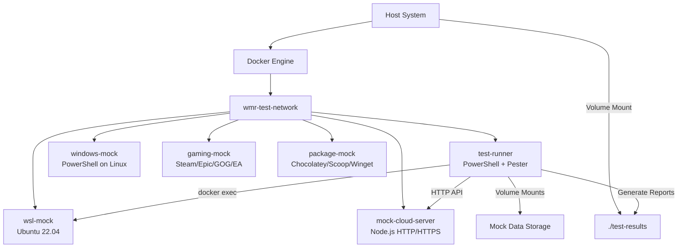

# Docker Testing Framework

This document provides comprehensive documentation for the Windows Melody Recovery Docker-based testing framework, including architecture, commands, test outputs, and container interconnections.

## Table of Contents

- [Overview](#overview)
- [Architecture](#architecture)
- [Container Services](#container-services)
- [Volume Management](#volume-management)
- [Network Configuration](#network-configuration)
- [Test Orchestration](#test-orchestration)
- [Commands and Usage](#commands-and-usage)
- [Test Results and Reporting](#test-results-and-reporting)
- [Mock Data and Environment](#mock-data-and-environment)
- [Troubleshooting](#troubleshooting)

## Overview

The Docker testing framework provides a comprehensive, isolated environment for testing Windows Melody Recovery functionality without requiring actual Windows installations or real cloud services. It simulates various Windows environments, WSL distributions, cloud storage services, and gaming platforms.

### Key Features

- **Isolated Testing Environment**: Complete isolation from host system
- **Multi-Platform Simulation**: Windows, WSL, and cloud services
- **Real Container Communication**: Actual docker exec between containers
- **Comprehensive Test Coverage**: Unit, integration, and end-to-end tests
- **Automated Reporting**: JSON, HTML, and console output formats
- **CI/CD Ready**: GitHub Actions integration and artifact generation

## Architecture



## Container Services

### test-runner

**Purpose**: Main test execution environment with PowerShell and Pester
**Base Image**: Custom PowerShell container with testing tools
**Key Features**:
- PowerShell Core with Pester testing framework
- Docker socket access for container communication
- Mock executable integration (wsl, winget, reg)
- Test orchestration and result generation

**Environment Variables**:
```yaml
PESTER_OUTPUT_PATH: /test-results
MOCK_WINDOWS_HOST: wmr-windows-mock
MOCK_WSL_HOST: wmr-wsl-mock
MOCK_CLOUD_HOST: wmr-cloud-mock
```

### windows-mock

**Purpose**: Simulates Windows PowerShell environment
**Base Image**: PowerShell on Linux
**Key Features**:
- Windows Registry simulation
- AppData and Program Files structure
- Windows-specific cmdlet mocking
- Integration with cloud storage mocks

### wsl-mock

**Purpose**: Real Ubuntu container for WSL functionality testing
**Base Image**: Ubuntu 22.04
**Key Features**:
- Complete Linux environment with development tools
- Package management (apt, npm, pip, snap)
- User configuration files (.bashrc, .gitconfig)
- SSH and development environment simulation

**Environment Variables**:
```yaml
WSL_DISTRO_NAME: Ubuntu-22.04
WSL_VERSION: 2
USER: testuser
HOME: /home/testuser
```

### mock-cloud-server

**Purpose**: HTTP/HTTPS server simulating cloud storage APIs
**Base Image**: Node.js
**Key Features**:
- Multi-provider support (OneDrive, Google Drive, Dropbox)
- RESTful API endpoints
- File upload/download simulation
- Health check endpoints

**Ports**:
- `8080`: HTTP endpoint
- `8443`: HTTPS endpoint

### gaming-mock

**Purpose**: Simulates gaming platform file structures
**Supported Platforms**:
- Steam (config.vdf, userdata, steamapps)
- Epic Games Store (config.json, manifests)
- GOG Galaxy (config.cfg, games database)
- EA Desktop (config.xml, cache)

### package-mock

**Purpose**: Simulates package manager environments
**Supported Managers**:
- Chocolatey (packages, config)
- Scoop (buckets, apps, config)
- Winget (sources, packages)

## Volume Management

### Host-Mounted Volumes

| Volume Mount | Container Path | Purpose |
|--------------|----------------|---------|
| `./` | `/workspace` | Source code and module access |
| `./test-results` | `/test-results` | Test results and reports output |
| `/var/run/docker.sock` | `/var/run/docker.sock` | Docker API access for container communication |

### Mock Data Volumes

| Host Path | Container Path | Purpose |
|-----------|----------------|---------|
| `./tests/mock-data/registry` | `/mock-registry` | Windows Registry simulation |
| `./tests/mock-data/appdata` | `/mock-appdata` | Windows AppData structure |
| `./tests/mock-data/programfiles` | `/mock-programfiles` | Program Files simulation |
| `./tests/mock-data/wsl/home` | `/mnt/test-data/home` | WSL user home directory |
| `./tests/mock-data/wsl/config` | `/mnt/test-data/config` | WSL configuration files |

### Docker Volumes

| Volume Name | Purpose |
|-------------|---------|
| `mock-cloud-storage` | Shared cloud storage simulation |
| `mock-steam` | Steam platform data |
| `mock-epic` | Epic Games Store data |
| `mock-gog` | GOG Galaxy data |
| `mock-ea` | EA Desktop data |

## Network Configuration

**Network Name**: `wmr-test-network`
**Driver**: bridge
**Purpose**: Isolated network for container communication

### Container Communication

```bash
# Test-runner can communicate with other containers by name
docker exec wmr-test-runner ping wmr-wsl-mock
docker exec wmr-test-runner curl http://wmr-cloud-mock:8080/health
```

## Test Orchestration

### Main Test Scripts

#### test-orchestrator.ps1
**Location**: `tests/scripts/test-orchestrator.ps1`
**Purpose**: Primary test execution and reporting engine

**Usage**:
```powershell
docker exec wmr-test-runner pwsh /tests/scripts/test-orchestrator.ps1 -TestSuite Backup
```

**Parameters**:
- `TestSuite`: All, Backup, Restore, WSL, Gaming, Cloud, Installation
- `OutputPath`: Test results path (default: /test-results)

**Features**:
- Automatic test discovery and execution
- Parallel test execution capability
- Comprehensive error handling
- JSON report generation
- Real-time progress reporting

#### run-integration-tests.ps1
**Location**: `run-integration-tests.ps1` (root)
**Purpose**: Host-level test orchestration and Docker management

**Usage**:
```powershell
pwsh .\run-integration-tests.ps1 -TestSuite WSL -GenerateReport
```

**Parameters**:
- `TestSuite`: Test suite to execute
- `GenerateReport`: Enable detailed reporting
- `SkipBuild`: Skip Docker image rebuilding
- `Cleanup`: Clean up test artifacts after execution

### Test Discovery and Execution Flow

1. **Environment Initialization**
   ```powershell
   Initialize-TestEnvironment
   # Creates test directories, loads Pester, validates environment
   ```

2. **Test Suite Selection**
   ```powershell
   switch ($TestSuite) {
       "Backup" { Invoke-BackupTests }
       "WSL" { Invoke-WSLTests }
       "All" { Invoke-AllTests }
   }
   ```

3. **Individual Test Execution**
   ```powershell
   Invoke-TestFile -TestPath $path -TestName $name
   # Runs Pester with PassThru for result collection
   ```

4. **Result Aggregation and Reporting**
   ```powershell
   Generate-TestReport
   Show-TestSummary
   ```

## Commands and Usage

### Starting the Test Environment

```bash
# Start all containers
docker-compose -f docker-compose.test.yml up -d

# Start specific service
docker-compose -f docker-compose.test.yml up -d test-runner

# Check container status
docker-compose -f docker-compose.test.yml ps
```

### Running Tests

#### Via Host Scripts
```powershell
# Run all tests with reporting
pwsh .\run-integration-tests.ps1 -TestSuite All -GenerateReport

# Run specific test suite
pwsh .\run-integration-tests.ps1 -TestSuite WSL

# Skip Docker build for faster iteration
pwsh .\run-integration-tests.ps1 -TestSuite Backup -SkipBuild
```

#### Direct Container Execution
```bash
# Run test orchestrator directly
docker exec wmr-test-runner pwsh /tests/scripts/test-orchestrator.ps1 -TestSuite Backup

# Run specific test file
docker exec wmr-test-runner pwsh -Command "Invoke-Pester /tests/integration/backup-applications.Tests.ps1 -Output Detailed"

# Interactive container access
docker exec -it wmr-test-runner pwsh
```

### Mock Command Testing

The test-runner container includes mock executables that route to appropriate containers:

```bash
# WSL commands route to wmr-wsl-mock container
docker exec wmr-test-runner wsl --version
docker exec wmr-test-runner wsl --list --quiet
docker exec wmr-test-runner wsl --exec bash -c "whoami"

# Registry commands simulate Windows registry
docker exec wmr-test-runner reg query "HKLM\SOFTWARE\Microsoft"

# Winget commands simulate package management
docker exec wmr-test-runner winget list
```

## Test Results and Reporting

### Output Directory Structure

```
test-results/
├── coverage/           # Code coverage reports
├── integration/        # Integration test artifacts  
├── logs/              # Detailed execution logs
├── reports/           # Structured test reports
└── unit/              # Unit test results
```

### Report Formats

#### JSON Reports
**Location**: `test-results/reports/test-summary-{timestamp}.json`
**Structure**:
```json
{
  "TestSuite": "Backup",
  "StartTime": "2025-07-01T19:56:27.0266301+00:00",
  "EndTime": "2025-07-01T19:56:36.2639684+00:00", 
  "Duration": "00:00:09.2342349",
  "TotalTests": 4,
  "PassedTests": 4,
  "FailedTests": 0,
  "SuccessRate": 100.0,
  "Results": [
    {
      "Name": "Applications Backup",
      "Status": "Passed",
      "PassedCount": 9,
      "FailedCount": 0,
      "Duration": null,
      "Timestamp": "2025-07-01T19:56:30.6192357+00:00"
    }
  ]
}
```

#### HTML Reports
**Generated by**: `tests/scripts/generate-reports.ps1`
**Features**:
- Visual test result dashboard
- Color-coded pass/fail indicators
- Sortable test results table
- Execution timing information

#### Console Output
**Real-time feedback**:
```
============================================================
  Windows Melody Recovery - Test Orchestrator
============================================================

Test Suite: Backup
Output Path: /test-results

✓ Applications Backup passed (9 tests)
✓ Gaming Platforms Backup passed (12 tests)
✓ Cloud Integration Backup passed (12 tests)
✓ System Settings Backup passed (8 tests)

🎉 All tests passed!
```

### Accessing Results

#### From Host System
```powershell
# View generated reports
Get-ChildItem test-results -Recurse

# Read latest JSON report
$latestReport = Get-ChildItem test-results/reports -Filter "*.json" | Sort-Object LastWriteTime -Descending | Select-Object -First 1
Get-Content $latestReport.FullName | ConvertFrom-Json
```

#### From Container
```bash
# List available reports
docker exec wmr-test-runner ls -la /test-results/reports/

# View report content
docker exec wmr-test-runner cat /test-results/reports/test-summary-latest.json
```

## Test Orchestration

### Main Scripts

#### test-orchestrator.ps1
- **Location**: `tests/scripts/test-orchestrator.ps1`
- **Purpose**: Primary test execution engine
- **Parameters**: TestSuite (All, Backup, Restore, WSL, Gaming, Cloud)

#### run-integration-tests.ps1  
- **Location**: Root directory
- **Purpose**: Host-level orchestration and Docker management
- **Parameters**: TestSuite, GenerateReport, SkipBuild, Cleanup

### Execution Flow

1. **Environment Initialization**: Create directories, load Pester
2. **Test Discovery**: Find and categorize test files
3. **Execution**: Run tests with result collection
4. **Reporting**: Generate JSON/HTML reports
5. **Cleanup**: Copy results to host, cleanup containers

## Mock Data and Environment

### Structure
```
tests/mock-data/
├── appdata/
│   └── Users/TestUser/AppData/
│       ├── Local/test-app.json
│       └── Roaming/Microsoft/Windows/
├── cloud/
│   ├── Dropbox/WindowsMissingRecovery/
│   ├── GoogleDrive/WindowsMissingRecovery/
│   └── OneDrive/WindowsMissingRecovery/
├── programfiles/
│   ├── Microsoft/Office/config.json
│   └── Steam/config.vdf
├── registry/
│   └── HKLM/SOFTWARE/Microsoft/
├── wsl/
│   ├── config/chezmoi.toml
│   ├── dotfiles/
│   └── home/testuser/
└── gaming-platforms/
    ├── steam/config.vdf
    ├── epic/config.json
    ├── gog/config.cfg
    └── ea/config.xml
```

### Mock Environment Variables

Each container is configured with specific environment variables to simulate realistic conditions:

**Windows Mock**:
```yaml
MOCK_MODE: true
CLOUD_PROVIDER: mock
BACKUP_ROOT: /workspace/test-backups
MACHINE_NAME: TEST-MACHINE
USER_PROFILE: /mock-appdata/Users/TestUser
```

**WSL Mock**:
```yaml
WSL_DISTRO_NAME: Ubuntu-22.04
WSL_VERSION: 2
USER: testuser
HOME: /home/testuser
```

**Cloud Mock**:
```yaml
CLOUD_TYPE: multi
ONEDRIVE_PATH: /cloud-storage/OneDrive
GOOGLEDRIVE_PATH: /cloud-storage/GoogleDrive
DROPBOX_PATH: /cloud-storage/Dropbox
```

## Troubleshooting

### Common Issues and Solutions

#### Container Communication Problems
```bash
# Check network connectivity
docker exec wmr-test-runner ping wmr-wsl-mock

# Verify container is running
docker-compose -f docker-compose.test.yml ps

# Check container logs
docker logs wmr-wsl-mock
```

#### Test Results Not Appearing
```bash
# Verify volume mount
docker exec wmr-test-runner ls -la /test-results

# Check host directory permissions
ls -la test-results/

# Manually copy results if needed
docker cp wmr-test-runner:/test-results/. ./test-results/
```

#### Mock Executable Issues
```bash
# Verify mock executables are available
docker exec wmr-test-runner which wsl
docker exec wmr-test-runner ls -la /usr/local/bin/

# Test mock functionality
docker exec wmr-test-runner wsl --version
```

#### Memory or Performance Issues
```bash
# Check container resource usage
docker stats

# Restart containers
docker-compose -f docker-compose.test.yml restart

# Clean up unused resources
docker system prune
```

### Debugging Commands

```bash
# Interactive debugging session
docker exec -it wmr-test-runner pwsh

# Run tests with verbose output
docker exec wmr-test-runner pwsh /tests/scripts/test-orchestrator.ps1 -TestSuite WSL -Verbose

# Check Pester installation
docker exec wmr-test-runner pwsh -Command "Get-Module -ListAvailable Pester"

# Validate mock data
docker exec wmr-wsl-mock ls -la /home/testuser
docker exec wmr-cloud-mock curl http://localhost:8080/health
```

### Log Analysis

#### Container Logs
```bash

# View all container logs
docker-compose -f docker-compose.test.yml logs

# Follow specific container logs
docker logs -f wmr-test-runner

# Get last N lines
docker logs wmr-cloud-mock --tail 50
```

#### Test Execution Logs
```bash
# View test orchestrator logs
docker exec wmr-test-runner cat /test-results/logs/test-orchestrator.log

# Monitor real-time test execution
docker exec wmr-test-runner tail -f /test-results/logs/test-orchestrator.log
```

## Best Practices

### Development Workflow

1. **Start with specific test suites** during development
2. **Use `-SkipBuild` flag** for faster iteration
3. **Check test results** before committing changes
4. **Clean up containers** regularly to prevent resource issues
5. **Validate mock data** matches real-world scenarios

### Performance Optimization

1. **Use parallel test execution** where possible
2. **Cache Docker images** for faster startup
3. **Mount only necessary volumes** to reduce I/O overhead
4. **Clean up test artifacts** between runs
5. **Monitor container resource usage**

### CI/CD Integration

The framework is designed for GitHub Actions integration:

```yaml
- name: Run Integration Tests
  run: |
    pwsh .\run-integration-tests.ps1 -TestSuite All -GenerateReport
    
- name: Upload Test Results
  uses: actions/upload-artifact@v4
  with:
    name: test-results
    path: test-results/
```

This testing framework provides comprehensive coverage for Windows Melody Recovery functionality while maintaining isolation and reproducibility across different environments.